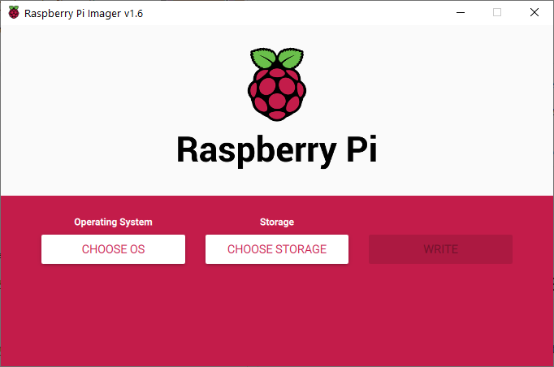
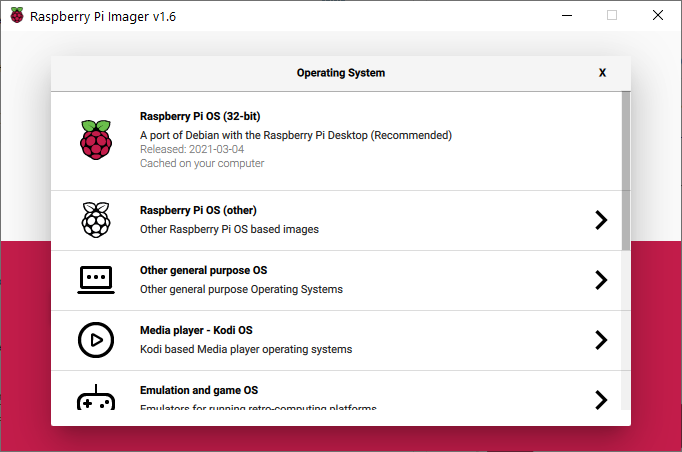

# Raspberry Pi 3B+ Setup

This documentation describes the setup for the Raspberry Pi off the package for the Payload.

## Overview and Payload Architecture

...

## Step 1: Install Raspbian OS

Download the Raspberry Pi Imager from the website [here](https://www.raspberrypi.org/software/).

Install the Raspberry Pi Imager and launch the Application once installed. The application looks like this.

Click `Choose OS` and select the recommended first option, `Raspberry Pi OS (32-bit)`.

  

Insert the MicroSD card into the PC and click `Choose Storage` to flash the OS onto under the `Storage` tab.

Select the storage volume to flash the OS onto.

  

Wait for the flashing to complete.

## Step 2: Set up the SD Card to enable SSH

Remove and insert the SD card into the PC again.

Enter the `boot` drive that the PC detects.

Create an empty file name `ssh` in `boot`.

This is done by going through the right click menu and creating a file as such.

  

## Step 3: Set up the Laptop and Ethernet connection to the Raspberry Pi

If using Ethernet via USB.

Go to the Laptop's Network Connection and set the Ethernet to obtain IP addresses automatically.

Share the Laptop's WiFi to the Raspberry Pi.

## Step 4: Boot up the Raspberry Pi

Boot up the Raspberry Pi and wait until you see the start up screen as such:

## Step 5: SSH into the Raspberry Pi

Open Putty and key the IP address into the terminal as shown below.

Use `sudo raspi-config` to start VNC.

### Step 6: Set up UART

Setting up the serial consolde in Raspberry Pi.

Source: [here](https://www.raspberrypi.org/documentation/configuration/uart.md) and [here](https://www.circuits.dk/setup-raspberry-pi-3-gpio-uart/)

Refer to Zoom video recorded. Transcribe it later.

[Video 1](https://youtu.be/Wx_LtSRWkB4)

[Video 2](https://youtu.be/2LdOYL3mz5s)

Add `core_freq=250` to `/boot/config.txt`
